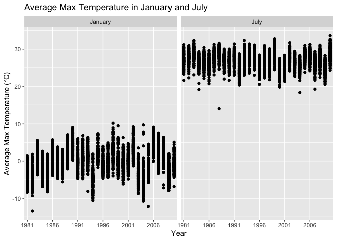
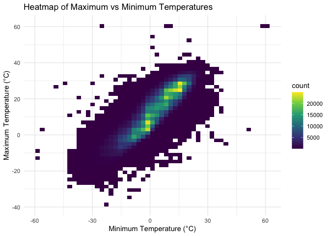
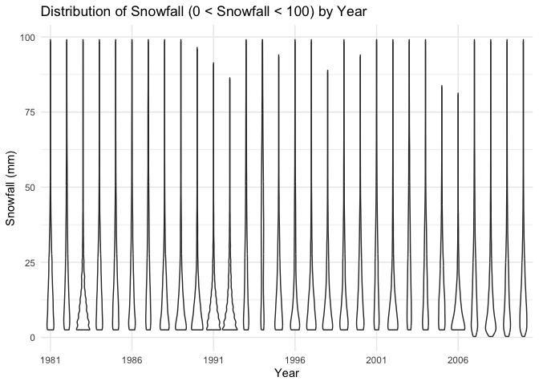
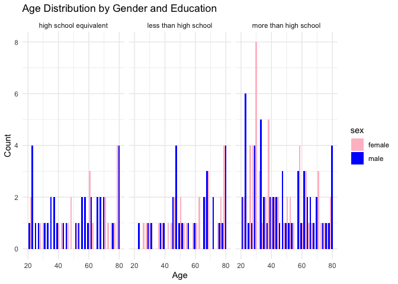
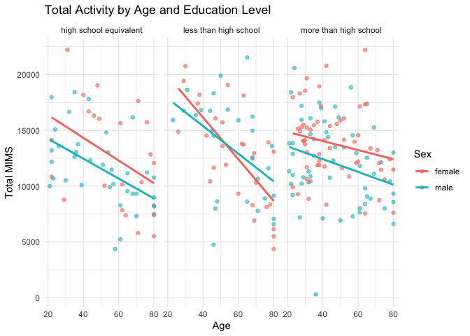
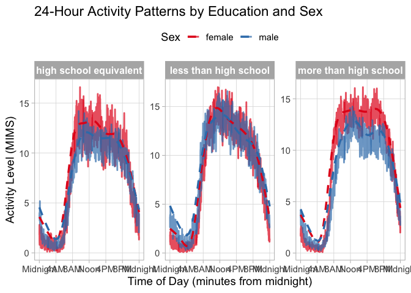

P8105_HW3_JG4890
================
Jiayi Ge
2024-10-09

# Problem 1

Import and clean Dataset

``` r
library(p8105.datasets)
library(dplyr)
```

    ## 
    ## Attaching package: 'dplyr'

    ## The following objects are masked from 'package:stats':
    ## 
    ##     filter, lag

    ## The following objects are masked from 'package:base':
    ## 
    ##     intersect, setdiff, setequal, union

``` r
library(janitor)
```

    ## 
    ## Attaching package: 'janitor'

    ## The following objects are masked from 'package:stats':
    ## 
    ##     chisq.test, fisher.test

``` r
library(lubridate)
```

    ## 
    ## Attaching package: 'lubridate'

    ## The following objects are masked from 'package:base':
    ## 
    ##     date, intersect, setdiff, union

``` r
data("ny_noaa")
noaa_clean <- ny_noaa %>%
  janitor::clean_names() %>%
#Change the units into a more reasonable ones
  mutate(
    prcp = as.numeric(prcp) / 10, 
    tmax = as.numeric(tmax) / 10, 
    tmin = as.numeric(tmin) / 10,
    snwd = as.numeric(snwd) / 10
  )%>%
  
#Create separate variables for year, month, and day
  mutate(year = year(date), month = month(date), day = day(date))
head(noaa_clean)
```

    ## # A tibble: 6 × 10
    ##   id          date        prcp  snow  snwd  tmax  tmin  year month   day
    ##   <chr>       <date>     <dbl> <int> <dbl> <dbl> <dbl> <dbl> <dbl> <int>
    ## 1 US1NYAB0001 2007-11-01    NA    NA    NA    NA    NA  2007    11     1
    ## 2 US1NYAB0001 2007-11-02    NA    NA    NA    NA    NA  2007    11     2
    ## 3 US1NYAB0001 2007-11-03    NA    NA    NA    NA    NA  2007    11     3
    ## 4 US1NYAB0001 2007-11-04    NA    NA    NA    NA    NA  2007    11     4
    ## 5 US1NYAB0001 2007-11-05    NA    NA    NA    NA    NA  2007    11     5
    ## 6 US1NYAB0001 2007-11-06    NA    NA    NA    NA    NA  2007    11     6

``` r
print(noaa_clean)
```

    ## # A tibble: 2,595,176 × 10
    ##    id          date        prcp  snow  snwd  tmax  tmin  year month   day
    ##    <chr>       <date>     <dbl> <int> <dbl> <dbl> <dbl> <dbl> <dbl> <int>
    ##  1 US1NYAB0001 2007-11-01    NA    NA    NA    NA    NA  2007    11     1
    ##  2 US1NYAB0001 2007-11-02    NA    NA    NA    NA    NA  2007    11     2
    ##  3 US1NYAB0001 2007-11-03    NA    NA    NA    NA    NA  2007    11     3
    ##  4 US1NYAB0001 2007-11-04    NA    NA    NA    NA    NA  2007    11     4
    ##  5 US1NYAB0001 2007-11-05    NA    NA    NA    NA    NA  2007    11     5
    ##  6 US1NYAB0001 2007-11-06    NA    NA    NA    NA    NA  2007    11     6
    ##  7 US1NYAB0001 2007-11-07    NA    NA    NA    NA    NA  2007    11     7
    ##  8 US1NYAB0001 2007-11-08    NA    NA    NA    NA    NA  2007    11     8
    ##  9 US1NYAB0001 2007-11-09    NA    NA    NA    NA    NA  2007    11     9
    ## 10 US1NYAB0001 2007-11-10    NA    NA    NA    NA    NA  2007    11    10
    ## # ℹ 2,595,166 more rows

Size and Structure: The NOAA dataset contains daily weather data from
several stations in New York State. The dataset has 2595176 rows and 7
columns which is over 2.5 million rows and multiple columns such as
`id`, `date`, `tmax`, `tmin`, `prcp`, `snwd`, and `snow`.

Key Variables:

`id`: Identifies the weather station. Weather station ID.

`date`: The date of the observation.

`tmax`, `tmin`: Maximum and minimum temperatures in tenths of degrees
Celsius.

`prcp`: Precipitation in tenths of millimeters.

`snow`: Snowfall in millimeters.

`snwd`: Snow depth mm.

`Missing Data`: Missing data is prevalent, especially for temperature
and precipitation measurements.

**Ensure observations in reasonable units**

`tmax` and `tmin` (maximum and minimum temperature) are recorded in
tenths of degrees Celsius, so dividing by 10 converts them to standard
°C.

`prcp` (precipitation) is recorded in tenths of millimeters, so dividing
by 10 converts it to millimeters.

`snwd` (snow depth) is recorded in millimeters, but since snow depth is
typically expressed in centimeters, dividing by 10 converts it to cm.

``` r
#To identify the most common snowfall values
noaa_clean %>%
  count(snow) %>%
  arrange(desc(n)) %>%
  head(5)
```

    ## # A tibble: 5 × 2
    ##    snow       n
    ##   <int>   <int>
    ## 1     0 2008508
    ## 2    NA  381221
    ## 3    25   31022
    ## 4    13   23095
    ## 5    51   18274

**Most commonly observed values For Snowfall**: The most common snowfall
value is 0, which means there is no snow on most days.

**Plot showing the average max temperature in January and in July in
each station across years**

``` r
library(ggplot2)
# Summarize average max temperature for January and July
jan_jul_summary <- noaa_clean %>%
  filter(month %in% c(1, 7)) %>%
  group_by(year, month,id) %>%
  summarize(avg_tmax = mean(tmax, na.rm = TRUE), .groups = "drop")
# Convert month to a factor for better plotting
jan_jul_summary <- jan_jul_summary %>%
  mutate(month = factor(month, labels = c("January", "July")))

# Create a bar plot for average max temperature
ggplot(jan_jul_summary, aes(x = factor(year), y = avg_tmax)) +
  geom_point() +
  facet_grid(. ~ month) +
  scale_x_discrete(breaks = seq(min(jan_jul_summary$year), max(jan_jul_summary$year), by = 5)) +
  labs(title = "Average Max Temperature in January and July",
       x = "Year",
       y = "Average Max Temperature (°C)") 
```

    ## Warning: Removed 5970 rows containing missing values or values outside the scale range
    ## (`geom_point()`).

<!-- --> In January,
the average max temperature is generally lower than in July.Meanwhile,
the average maximum temperature in July appears to be more stable than
the average maximum temperature in January. In the January chart, there
are several outliers in both the upper and lower regions of the
distribution, and there is more variation overall. In July, some
individual outliers were below the overdistribution, but the overall
level was stable.

**(i) `tmax` vs `tmin` for the full datase**

``` r
# Create a heatmap for tmax vs tmin
ggplot(noaa_clean, aes(x = tmin, y = tmax)) +
  geom_bin2d(bins = 50) +
  scale_fill_viridis_c() + 
  labs(title = "Heatmap of Maximum vs Minimum Temperatures",
       x = "Minimum Temperature (°C)",
       y = "Maximum Temperature (°C)") +
  theme_minimal()
```

    ## Warning: Removed 1136276 rows containing non-finite outside the scale range
    ## (`stat_bin2d()`).

<!-- -->

**(ii) The distribution of snowfall values greater than 0 and less than
100 separately by year**

``` r
snowfall_filtered <- noaa_clean %>%
  filter(snwd > 0 & snwd < 100)

ggplot(snowfall_filtered, aes(x = factor(year), y = snwd)) +
  geom_boxplot() +
  labs(title = "Distribution of Snowfall (0 < Snowfall < 100) by Year",
       x = "Year",
       y = "Snowfall (mm)") +
  theme_minimal() +
  scale_x_discrete(breaks = seq(min(snowfall_filtered$year), max(snowfall_filtered$year), by = 5))  # Display every 5 years
```

<!-- -->

# Problem 2

Import data for problem 2

``` r
library(readr)
nhanes_accel = 
  read_csv("./nhanes_accel.csv", na = c("NA", ",", "")) %>%
  janitor::clean_names()
```

    ## Rows: 250 Columns: 1441
    ## ── Column specification ────────────────────────────────────────────────────────
    ## Delimiter: ","
    ## dbl (1441): SEQN, min1, min2, min3, min4, min5, min6, min7, min8, min9, min1...
    ## 
    ## ℹ Use `spec()` to retrieve the full column specification for this data.
    ## ℹ Specify the column types or set `show_col_types = FALSE` to quiet this message.

``` r
nhanes_covar = 
  read_csv("./nhanes_covar.csv", na = c("NA", ",", ""),skip = 4) %>%
  janitor::clean_names()%>%
  mutate(
    sex = case_when(
      sex == 1 ~ "male", 
      sex == 2 ~ "female"
    ),
    sex = factor(sex),
    education = case_when(
      education == 1 ~ "less than high school", 
      education == 2 ~ "high school equivalent", 
      education == 3 ~ "more than high school"
    ),
    education = factor(education)
  )
```

    ## Rows: 250 Columns: 5
    ## ── Column specification ────────────────────────────────────────────────────────
    ## Delimiter: ","
    ## dbl (5): SEQN, sex, age, BMI, education
    ## 
    ## ℹ Use `spec()` to retrieve the full column specification for this data.
    ## ℹ Specify the column types or set `show_col_types = FALSE` to quiet this message.

``` r
#Exclude participants less than 21 years of age, and those with missing demographic data
nhanes_mims = 
  left_join(nhanes_accel, nhanes_covar)%>%
  filter(!is.na(education) & age >= 21) 
```

    ## Joining with `by = join_by(seqn)`

\*\* Table for Men and Women by Education\*\*

``` r
nhanes_mims%>%
  group_by(education, sex)%>%
  janitor::tabyl(sex, education)
```

    ##     sex high school equivalent less than high school more than high school
    ##  female                     23                    29                    59
    ##    male                     36                    28                    56

From this table, we can see that the largest number of participants had
an education level beyond high school, and the number of participants
who did not complete high school was about the same as the number who
completed high school.

``` r
# Plot age distribution by gender and education using your grouped data

ggplot(nhanes_mims, aes(x = age, fill = sex)) +
  geom_histogram(position = "dodge", bins = 30) + 
  facet_grid( ~ education) +
  labs(title = "Age Distribution by Gender and Education",
       x = "Age", y = "Count") +
  scale_fill_manual(values = c( "pink", "blue")) +

  theme_minimal()
```

<!-- --> From this
graph, we can see that, on the whole, those aged between 20 and 40 have
the highest count on more than high school. Also, the age distribution
and sex distribution of those who did not complete high school or
completed an equivalent high school, as seen in the first two sections,
appear to be relatively consistent.

**Plot of Total Activity by Age and Education Level**

``` r
nhanes_mims %>%
  mutate(total_mims = rowSums(across(min1:min1440), na.rm = TRUE)) %>%  # Calculate total MIMS
  ggplot(aes(x = age, y = total_mims, color = sex)) + 
  geom_point(alpha = 0.6) +  # Scatter points
  geom_smooth(method = "lm", se = FALSE) +  # Add a linear trend line 
  facet_wrap(~ education) +  # Separate panels for education levels
  labs(
    title = "Total Activity by Age and Education Level",
    color = "Sex",
    x = "Age",
    y = "Total MIMS"
  ) +
  theme_minimal()  
```

    ## `geom_smooth()` using formula = 'y ~ x'

<!-- --> As shown in
the figure, we can see that overall, regardless of gender and education,
the total amount of activity decreases with age. The highest activity in
all three graphs is the leftmost point. At the same time, both the “high
school equivalent education” and “higher than high school education”
groups had higher activity.

**Scatter Plot of Total MIMS by Age Across Sex and Education**

``` r
library(tidyr)

nhanes_data_df <- nhanes_mims %>%
  pivot_longer(
    cols = min1:min1440,
    names_to = "minute",
    values_to = "MIMS",
    names_prefix = "min") %>%
  group_by(seqn, sex, age, education) %>%
  summarize(total_activity = sum(MIMS, na.rm = TRUE), .groups = "drop")  # Calculate total activity

# Plot total activity against age, with facets by education level
ggplot(nhanes_data_df, aes(x = age, y = total_activity, color = sex)) + 
  geom_point(alpha = 0.6) +  # Scatter points
  geom_smooth(se = FALSE) +  # Add a trend line
  facet_grid(. ~ education) +  # Separate panels for education levels
  labs(
    title = "Total MIMS by Age and Education Level",
    x = "Age",
    y = "Total Activity (MIMS)",
    caption = "NHANES data of participants aged 21 and over"
  ) +
  theme_minimal()  
```

    ## `geom_smooth()` using method = 'loess' and formula = 'y ~ x'

<!-- --> From our
picture, we can see that the regression line trend is basically similar
for men and women at the three different levels of education. It was
also found that in the “high school equivalent” and “above high school”
groups, women of all ages were more active overall than men. In the
“below high school” group, only female participants under the age of 50
had higher total activity than men. At the same time, there are some
outliers in all three graphs.

# Problem 3

Import and clean all the data

``` r
Jan_2020_bike <- read_csv("./citibike/Jan 2020 Citi.csv", na = c("NA", ".", "")) %>%
  janitor::clean_names()
```

    ## Rows: 12420 Columns: 7
    ## ── Column specification ────────────────────────────────────────────────────────
    ## Delimiter: ","
    ## chr (6): ride_id, rideable_type, weekdays, start_station_name, end_station_n...
    ## dbl (1): duration
    ## 
    ## ℹ Use `spec()` to retrieve the full column specification for this data.
    ## ℹ Specify the column types or set `show_col_types = FALSE` to quiet this message.

``` r
Jan_2024_bike <- read_csv("./citibike/Jan 2024 Citi.csv", na = c("NA", ".", "")) %>%
  janitor::clean_names()
```

    ## Rows: 18861 Columns: 7
    ## ── Column specification ────────────────────────────────────────────────────────
    ## Delimiter: ","
    ## chr (6): ride_id, rideable_type, weekdays, start_station_name, end_station_n...
    ## dbl (1): duration
    ## 
    ## ℹ Use `spec()` to retrieve the full column specification for this data.
    ## ℹ Specify the column types or set `show_col_types = FALSE` to quiet this message.

``` r
July_2020_bike <- read_csv("./citibike/July 2020 Citi.csv", na = c("NA", ".", "")) %>%
  janitor::clean_names()
```

    ## Rows: 21048 Columns: 7
    ## ── Column specification ────────────────────────────────────────────────────────
    ## Delimiter: ","
    ## chr (6): ride_id, rideable_type, weekdays, start_station_name, end_station_n...
    ## dbl (1): duration
    ## 
    ## ℹ Use `spec()` to retrieve the full column specification for this data.
    ## ℹ Specify the column types or set `show_col_types = FALSE` to quiet this message.

``` r
July_2024_bike <- read_csv("./citibike/July 2024 Citi.csv", na = c("NA", ".", "")) %>%
  janitor::clean_names()
```

    ## Rows: 47156 Columns: 7
    ## ── Column specification ────────────────────────────────────────────────────────
    ## Delimiter: ","
    ## chr (6): ride_id, rideable_type, weekdays, start_station_name, end_station_n...
    ## dbl (1): duration
    ## 
    ## ℹ Use `spec()` to retrieve the full column specification for this data.
    ## ℹ Specify the column types or set `show_col_types = FALSE` to quiet this message.

``` r
citi_bike_data <- bind_rows(Jan_2020_bike, Jan_2024_bike, July_2020_bike, July_2024_bike)
glimpse(citi_bike_data)
```

    ## Rows: 99,485
    ## Columns: 7
    ## $ ride_id            <chr> "4BE06CB33B037044", "26886E034974493B", "24DC56060E…
    ## $ rideable_type      <chr> "classic_bike", "classic_bike", "classic_bike", "cl…
    ## $ weekdays           <chr> "Tuesday", "Wednesday", "Friday", "Sunday", "Friday…
    ## $ duration           <dbl> 15.333267, 5.309467, 9.691800, 6.996183, 2.849500, …
    ## $ start_station_name <chr> "Columbus Ave & W 95 St", "2 Ave & E 96 St", "Colum…
    ## $ end_station_name   <chr> "E 53 St & Madison Ave", "1 Ave & E 110 St", "Grand…
    ## $ member_casual      <chr> "member", "member", "member", "member", "member", "…

The `citi_bike_data` tibble has 99,485 rows and 7 columns between
January 2020, July 2020, January 2024, and July 2024. The variables
include:

ride_id: Unique identifier for each ride

rideable_type: Type of bike (e.g., electric or classic)

weekdays: Day of the week the ride occurred

duration: Duration of the ride in minutes

start_station_name: Starting station of the ride

end_station_name: Ending station of the ride

member_casual: Indicates whether the rider is a casual user or a Citi
Bike member.

**Separating casual riders and Citi Bike members**

``` r
combined_summary <- bind_rows(
  Jan_2020_bike %>% group_by(member_casual) %>% summarise(total_rides = n()) %>% mutate(year = 2020, month = "January"),
  Jan_2024_bike %>% group_by(member_casual) %>% summarise(total_rides = n()) %>% mutate(year = 2024, month = "January"),
  July_2020_bike %>% group_by(member_casual) %>% summarise(total_rides = n()) %>% mutate(year = 2020, month = "July"),
  July_2024_bike %>% group_by(member_casual) %>% summarise(total_rides = n()) %>% mutate(year = 2024, month = "July")
)
print(combined_summary)
```

    ## # A tibble: 8 × 4
    ##   member_casual total_rides  year month  
    ##   <chr>               <int> <dbl> <chr>  
    ## 1 casual                984  2020 January
    ## 2 member              11436  2020 January
    ## 3 casual               2108  2024 January
    ## 4 member              16753  2024 January
    ## 5 casual               5637  2020 July   
    ## 6 member              15411  2020 July   
    ## 7 casual              10894  2024 July   
    ## 8 member              36262  2024 July

The output shows a summary of Citi Bike rides in January and July for
the years 2020 and 2024, separated by rider type (casual and member).

Casual riders: In January 2020, there were 984 rides, while in July
2020, there were 5,637 rides. In January 2024, this increased to 2,108
rides, and in July 2024, there were 10,894 rides.

Members: The rides taken by members are significantly higher, with
11,436 in January 2020, 15,411 in July 2020, and increasing to 16,753 in
January 2024 and 36,262 in July 2024.
