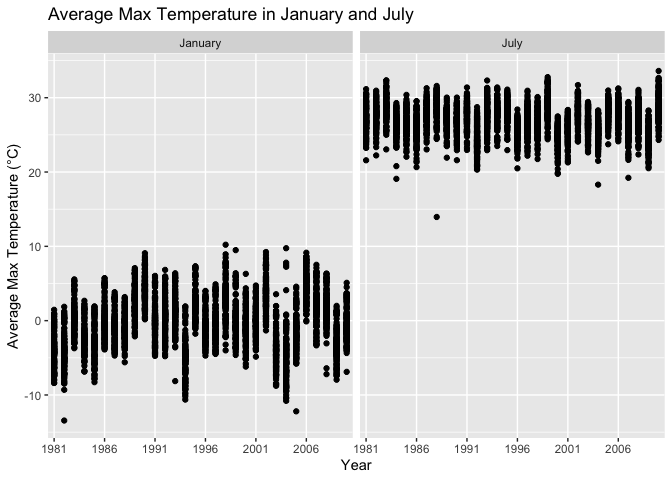

P8105_HW3_JG4890
================
Jiayi Ge
2024-10-09

\##Problem 1 Import and clean Dataset

``` r
library(p8105.datasets)
library(dplyr)
```

    ## 
    ## Attaching package: 'dplyr'

    ## The following objects are masked from 'package:stats':
    ## 
    ##     filter, lag

    ## The following objects are masked from 'package:base':
    ## 
    ##     intersect, setdiff, setequal, union

``` r
library(janitor)
```

    ## 
    ## Attaching package: 'janitor'

    ## The following objects are masked from 'package:stats':
    ## 
    ##     chisq.test, fisher.test

``` r
library(lubridate)
```

    ## 
    ## Attaching package: 'lubridate'

    ## The following objects are masked from 'package:base':
    ## 
    ##     date, intersect, setdiff, union

``` r
data("ny_noaa")
noaa_clean <- ny_noaa %>%
  janitor::clean_names() %>%
  mutate(
    prcp = as.numeric(prcp) / 10, 
    tmax = as.numeric(tmax) / 10, 
    tmin = as.numeric(tmin) / 10,
    snwd = as.numeric(snwd) / 10
  )%>%
  mutate(year = year(date), month = month(date), day = day(date))
head(noaa_clean)
```

    ## # A tibble: 6 × 10
    ##   id          date        prcp  snow  snwd  tmax  tmin  year month   day
    ##   <chr>       <date>     <dbl> <int> <dbl> <dbl> <dbl> <dbl> <dbl> <int>
    ## 1 US1NYAB0001 2007-11-01    NA    NA    NA    NA    NA  2007    11     1
    ## 2 US1NYAB0001 2007-11-02    NA    NA    NA    NA    NA  2007    11     2
    ## 3 US1NYAB0001 2007-11-03    NA    NA    NA    NA    NA  2007    11     3
    ## 4 US1NYAB0001 2007-11-04    NA    NA    NA    NA    NA  2007    11     4
    ## 5 US1NYAB0001 2007-11-05    NA    NA    NA    NA    NA  2007    11     5
    ## 6 US1NYAB0001 2007-11-06    NA    NA    NA    NA    NA  2007    11     6

``` r
print(noaa_clean)
```

    ## # A tibble: 2,595,176 × 10
    ##    id          date        prcp  snow  snwd  tmax  tmin  year month   day
    ##    <chr>       <date>     <dbl> <int> <dbl> <dbl> <dbl> <dbl> <dbl> <int>
    ##  1 US1NYAB0001 2007-11-01    NA    NA    NA    NA    NA  2007    11     1
    ##  2 US1NYAB0001 2007-11-02    NA    NA    NA    NA    NA  2007    11     2
    ##  3 US1NYAB0001 2007-11-03    NA    NA    NA    NA    NA  2007    11     3
    ##  4 US1NYAB0001 2007-11-04    NA    NA    NA    NA    NA  2007    11     4
    ##  5 US1NYAB0001 2007-11-05    NA    NA    NA    NA    NA  2007    11     5
    ##  6 US1NYAB0001 2007-11-06    NA    NA    NA    NA    NA  2007    11     6
    ##  7 US1NYAB0001 2007-11-07    NA    NA    NA    NA    NA  2007    11     7
    ##  8 US1NYAB0001 2007-11-08    NA    NA    NA    NA    NA  2007    11     8
    ##  9 US1NYAB0001 2007-11-09    NA    NA    NA    NA    NA  2007    11     9
    ## 10 US1NYAB0001 2007-11-10    NA    NA    NA    NA    NA  2007    11    10
    ## # ℹ 2,595,166 more rows

``` r
#To identify the most common snowfall values
noaa_clean %>%
  count(snow) %>%
  arrange(desc(n)) %>%
  head(5)
```

    ## # A tibble: 5 × 2
    ##    snow       n
    ##   <int>   <int>
    ## 1     0 2008508
    ## 2    NA  381221
    ## 3    25   31022
    ## 4    13   23095
    ## 5    51   18274

Size and Structure: The NOAA dataset contains daily weather data from
several stations in New York State. The dataset has 2595176 rows and 7
columns which is over 2.5 million rows and multiple columns such as
`id`, `date`, `tmax`, `tmin`, `prcp`, `snwd`, and `snow`.

Key Variables:

`id`: Identifies the weather station. Weather station ID.

`date`: The date of the observation.

`tmax`, `tmin`: Maximum and minimum temperatures in tenths of degrees
Celsius.

`prcp`: Precipitation in tenths of millimeters.

`snow`: Snowfall in millimeters.

`snwd`: Snow depth mm.

`Missing Data`: Missing data is prevalent, especially for temperature
and precipitation measurements. We will explore this further.

**Ensure observations in reasonable units**

`tmax` and `tmin` (maximum and minimum temperature) are recorded in
tenths of degrees Celsius, so dividing by 10 converts them to standard
°C.

`prcp` (precipitation) is recorded in tenths of millimeters, so dividing
by 10 converts it to millimeters.

`snwd` (snow depth) is recorded in millimeters, but since snow depth is
typically expressed in centimeters, dividing by 10 converts it to cm.

**Most commonly observed values For Snowfall**: The most common snowfall
value is 0, which means there is no snow on most days.

``` r
library(ggplot2)
# Summarize average max temperature for January and July
jan_jul_summary <- noaa_clean %>%
  filter(month %in% c(1, 7)) %>%
  group_by(year, month,id) %>%
  summarize(avg_tmax = mean(tmax, na.rm = TRUE), .groups = "drop")
# Convert month to a factor for better plotting
jan_jul_summary <- jan_jul_summary %>%
  mutate(month = factor(month, labels = c("January", "July")))

# Create a bar plot for average max temperature
ggplot(jan_jul_summary, aes(x = factor(year), y = avg_tmax)) +
  geom_point() +
  facet_grid(. ~ month) +
  scale_x_discrete(breaks = seq(min(jan_jul_summary$year), max(jan_jul_summary$year), by = 5)) +
  labs(title = "Average Max Temperature in January and July",
       x = "Year",
       y = "Average Max Temperature (°C)") 
```

    ## Warning: Removed 5970 rows containing missing values or values outside the scale range
    ## (`geom_point()`).

<!-- --> In January,
the average max temperature is generally lower than in July.Meanwhile,
the average maximum temperature in July appears to be more stable than
the average maximum temperature in January. In the January chart, there
are several outliers in both the upper and lower regions of the
distribution, and there is more variation overall. In July, some
individual outliers were below the overdistribution, but the overall
level was stable.
